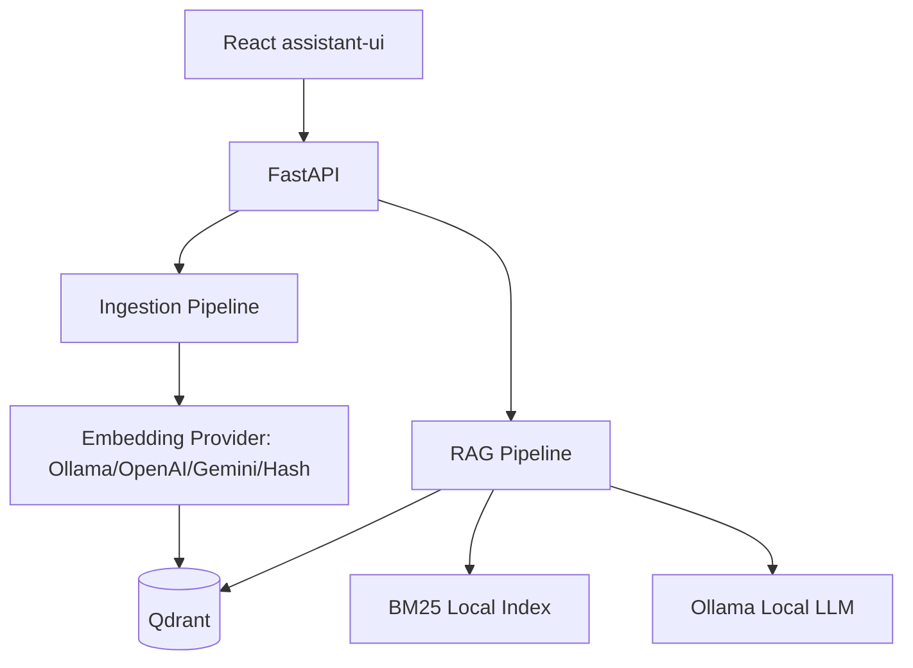

# AI Knowledge Assistant

Internal RAG chatbot for Việt Thái Dương knowledge documents. The source code
contains the engine only; documents are uploaded or ingested at runtime.

## Architecture



## Requirements

- Docker Desktop
- Ollama if using local LLM or local embeddings
- Python 3.11 and `uv` for local development
- Node.js and npm for local UI development

## Setup

```powershell
uv sync
cd frontend
npm install
cd ..
copy .env.example .env
```

The default `.env.example` uses Ollama `bge-m3` for local embeddings. Pull the
embedding and generation models before running with Ollama:

```powershell
ollama pull bge-m3
ollama pull qwen2.5:14b-instruct
```

For local smoke tests without real semantic embedding, set:

```env
EMBEDDING_PROVIDER=hash
LLM_PROVIDER=echo
```

The first local generation can be slow while the model is loaded.
`LLM_TIMEOUT_SECONDS` defaults to 240 seconds.

## Run Qdrant

```powershell
docker compose up -d qdrant
```

## Run API and UI

Terminal 1:

```powershell
uv run uvicorn app.main:app --host 0.0.0.0 --port 8000 --reload
```

Terminal 2:

```powershell
cd frontend
npm run dev
```

Alternative UI launcher from repo root:

```powershell
uv run python ui.py
```

Open:

- API docs: http://localhost:8000/docs
- Local UI dev server: http://localhost:5173

The React UI uses assistant-ui and calls the backend through relative `/api` and
`/health` routes. In local development, Vite proxies those routes to
`http://localhost:8000`.

## Docker

```powershell
docker compose up -d --build
```

Open:

- UI: http://localhost:8501
- API docs: http://localhost:8000/docs

In Docker, the UI container serves the React build with Nginx and proxies `/api`
and `/health` to the API container.

## Agent Harness

This repository is the system of record for future agent sessions:

- Start with `AGENTS.md`.
- Read `CONSTRAINTS.md` before changing ingestion, retrieval, storage, or deployment.
- Read `PROGRESS.md` for durable current status.
- Read local `ARCHITECTURE.md` files beside modules before changing them.

Verify the harness and code:

```powershell
uv run ruff check . --no-cache
uv run pytest tests/unit
uv run python scripts/check_harness.py
cd frontend
npm run build
```

Or through Make:

```powershell
make check
make ui-build
```
