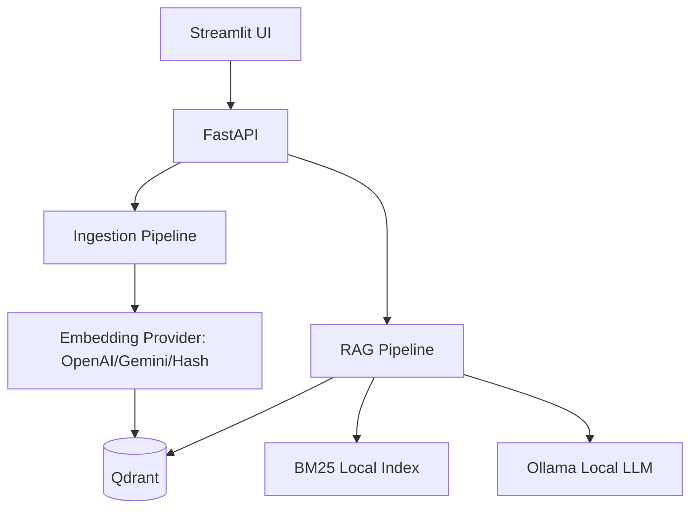

# AI Knowledge Assistant

Internal RAG chatbot for Việt Thái Dương knowledge documents. The source code contains the engine only; documents are uploaded or ingested at runtime.

## Architecture



## Requirements

- Docker Desktop
- Ollama if using local LLM
- Python 3.11 and `uv` for local development

## Setup

```bash
uv sync --extra dev
copy .env.example .env
```

Fill `.env` with either OpenAI or Gemini embedding credentials. For local smoke tests without external embedding, set:

```env
EMBEDDING_PROVIDER=hash
LLM_PROVIDER=echo
```

For Ollama:

```bash
ollama pull qwen2.5:3b-instruct
```

The first local generation can be slow while the model is loaded. `LLM_TIMEOUT_SECONDS`
defaults to 240 seconds.

## Run Qdrant

```bash
docker compose up -d qdrant
```

## Run API and UI

```bash
uv run uvicorn app.main:app --host 0.0.0.0 --port 8000 --reload
uv run streamlit run ui/streamlit_app.py
```

Open:

- API docs: http://localhost:8000/docs
- UI: http://localhost:8501

## Upload Documents

Use the UI "Tài liệu" tab, or call:

```bash
curl -F "file=@document.docx" http://localhost:8000/api/v1/documents
```

Each document is stored under its own runtime directory:

```text
data/documents/{document_id}/
├── original/source.docx
├── images/image-001.png
└── processed/
    ├── chunks.json
    ├── images.json
    └── manifest.json
```

Adding a document always runs the full ingestion pipeline: validate, store original,
parse text/tables/images, chunk, embed, index, and publish. Store-only upload is not
used.

## Ingest From CLI

```bash
uv run python scripts/ingest_documents.py --input "C:\Users\Admin\Downloads\Nội Quy và Văn Hóa của Việt Thái Dương.docx" --input "C:\Users\Admin\Downloads\Quy Định và Kiến Thức Cơ bản.docx"
```

Or add one document:

```bash
uv run python scripts/add_document.py --input "C:\path\to\document.docx"
```

## Inspect Chunks

```bash
uv run python scripts/inspect_chunks.py
```

Outputs:

- `data/processed/chunks.json`
- `data/processed/chunks_preview.md`

## Evaluate Retrieval

```bash
uv run python scripts/evaluate_retrieval.py
```

The script computes Hit Rate@K, Recall@K, MRR, exact section match, and average retrieval latency using real retrieval results.

## API

- `GET /health`
- `POST /api/v1/chat`
- `POST /api/v1/debug/retrieve`
- `GET /api/v1/documents`
- `POST /api/v1/documents`
- `POST /api/v1/documents/{document_id}/reindex`
- `DELETE /api/v1/documents/{document_id}`

## Notes

- Retrieval happens before generation. The LLM only sees bounded context blocks with `SOURCE_n` IDs.
- Citations can include related image URLs extracted from DOCX. Images are not OCRed or embedded.
- Uploaded document text is treated as untrusted data, never as system instructions.
- No authentication is included in this MVP.
- Qdrant stores chunk payload and vectors. A local manifest JSON tracks uploaded documents and file hashes.
