# TÀI LIỆU KỸ THUẬT: AI Knowledge Assistant

## 1. Thông Tin Tài Liệu

| Trường | Giá trị |
|---|---|
| Hệ thống | `ai-knowledge-assistant` |
| Phạm vi | Kiến trúc hiện tại, service, source layout, API, RAG, AI provider, storage, deployment, vận hành, rủi ro |
| Nguồn dữ liệu | Source code hiện tại, `docs/01-source-audit.md`, `docs/02-document-outline.md` |
| Trạng thái | Tài liệu kỹ thuật theo source hiện tại |
| Secret | Không ghi secret thật; chỉ ghi tên biến môi trường |

Source: `pyproject.toml`  
Function/Class: `[project]`

Source: `docs/01-source-audit.md`  
Function/Class: N/A

## 2. Executive Summary

`ai-knowledge-assistant` là một hệ thống AI Knowledge Assistant nội bộ. Hệ thống có 3 service xác định được từ source: API FastAPI, UI Streamlit và Qdrant vector database.

API nhận câu hỏi, truy xuất chunk tài liệu từ Qdrant và BM25, xây dựng context, gọi LLM provider, rồi trả lời kèm citation. UI Streamlit gọi API để chat, upload tài liệu và hiển thị citation/image. Qdrant lưu vector embedding của chunk tài liệu. File system trong `data` lưu file gốc, image extract, manifest và snapshot chunk.

Các thành phần chưa xác định được từ source code hiện tại: relational database, Redis server, queue, Pub/Sub, WebSocket, STT, TTS, authentication, CI/CD, nginx, systemd, GPU config, metrics/tracing/log aggregation.

Source: `docs/01-source-audit.md`  
Function/Class: N/A

## 3. Tổng Quan Hệ Thống

### 3.1 Service Và Vai Trò

| Service | Entry point | Công nghệ | Vai trò | Giao tiếp |
|---|---|---|---|---|
| API service | `app.main:app`; `main:run_api` | FastAPI, Uvicorn, Pydantic Settings, httpx, qdrant-client | REST API cho health, chat, document ingestion, reindex, delete, image serving | Nhận HTTP từ UI/client; gọi Qdrant và AI providers |
| UI service | `ui/streamlit_app.py`; `ui:run_ui` | Streamlit, requests | Giao diện chat và quản lý tài liệu | Gọi API qua `API_BASE_URL` |
| Qdrant service | Docker Compose `qdrant` | Qdrant `qdrant/qdrant:v1.12.1` | Vector database cho embedding của chunk | API service gọi qua `AsyncQdrantClient` |

Source: `app/main.py`  
Function/Class: `create_app()`

Source: `main.py`  
Function/Class: `run_api()`

Source: `ui.py`  
Function/Class: `run_ui()`

Source: `ui/streamlit_app.py`  
Function/Class: module Streamlit app

Source: `docker-compose.yml`  
Function/Class: `services`

### 3.2 Dữ Liệu Vào/Ra

| Loại dữ liệu | Điểm vào | Xử lý | Điểm ra |
|---|---|---|---|
| Câu hỏi chat | `POST /api/v1/chat` hoặc `st.chat_input` | RAG pipeline | `ChatResponse` gồm `answer`, `citations`, `retrieval`, `timing_ms` |
| Tài liệu | `POST /api/v1/documents` hoặc Streamlit uploader | Ingestion pipeline | Manifest, chunk files, image files, Qdrant vectors |
| Document filter | `ChatRequest.filters` | Chuyển thành `RetrievalFilters` | Qdrant filter và BM25 filter |
| Image citation | `/api/v1/documents/{document_id}/images/{file_name}` | File path guard rồi serve file | `FileResponse` |

Source: `app/api/schemas.py`  
Function/Class: `ChatRequest`, `ChatResponse`, `DocumentResponse`

Source: `app/api/routes_chat.py`  
Function/Class: `chat()`

Source: `app/api/routes_documents.py`  
Function/Class: `add_document()`, `get_document_image()`

## 4. Kiến Trúc Tổng Thể

### 4.1 Architecture Diagram

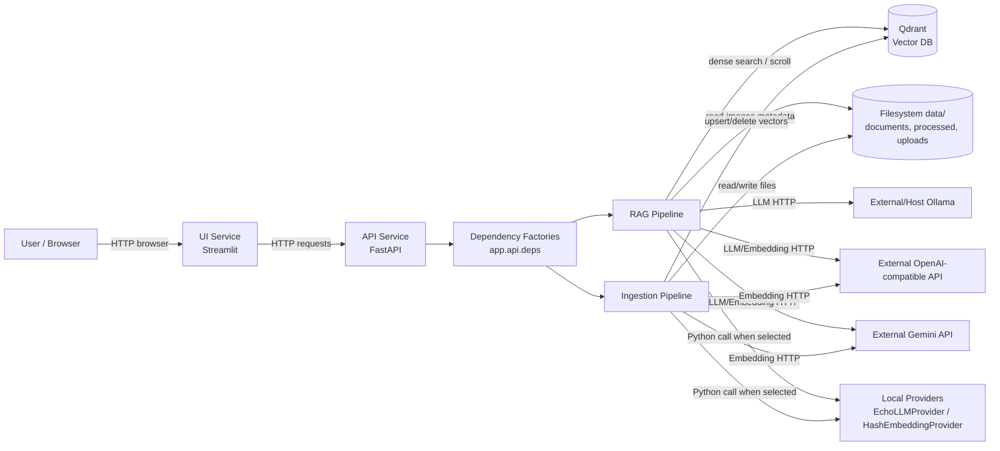

### 4.2 Component Table

| Component | Kiến trúc hiện tại | Giao tiếp | Source |
|---|---|---|---|
| `app.main` | Tạo FastAPI app, include router, middleware request ID, exception handler | Nhận HTTP | Source: `app/main.py`; Function/Class: `create_app()` |
| `app.api.routes_chat` | REST endpoint chat/debug retrieve | Gọi `RAGPipeline` | Source: `app/api/routes_chat.py`; Function/Class: `chat()`, `debug_retrieve()` |
| `app.api.routes_documents` | REST endpoint document list/upload/reindex/delete/image | Gọi `IngestionPipeline`, `QdrantVectorStore`, `ManifestStore`, `Retriever` | Source: `app/api/routes_documents.py`; Function/Class: route functions |
| `app.api.deps` | Tạo dependency singleton bằng `lru_cache`, riêng ingestion pipeline không cache | Python function calls | Source: `app/api/deps.py`; Function/Class: `get_*()` |
| `app.ingestion.pipeline` | Parse/chunk/embed/index tài liệu | File system, embedding provider, vector store | Source: `app/ingestion/pipeline.py`; Function/Class: `IngestionPipeline` |
| `app.rag.pipeline` | Normalize, retrieve, build context, call LLM, validate citation | Retriever, LLM provider, file image lookup | Source: `app/rag/pipeline.py`; Function/Class: `RAGPipeline` |
| `app.rag.retriever` | Dense retrieval + BM25 + RRF | Embedding provider, Qdrant, in-memory BM25 | Source: `app/rag/retriever.py`; Function/Class: `Retriever` |
| `app.providers.llm` | Ollama/OpenAI-compatible/Gemini/Echo LLM providers | HTTP hoặc local provider | Source: `app/providers/llm/factory.py`; Function/Class: `create_llm_provider()` |
| `app.providers.embeddings` | OpenAI/Gemini/Hash embedding providers | HTTP hoặc local hashing | Source: `app/providers/embeddings/api_provider.py`; Function/Class: `create_embedding_provider()` |
| `app.providers.vector_store` | Qdrant adapter | Qdrant client | Source: `app/providers/vector_store/qdrant_store.py`; Function/Class: `QdrantVectorStore` |
| `ui.streamlit_app` | UI chat/upload/list documents | HTTP requests tới API | Source: `ui/streamlit_app.py`; Function/Class: module Streamlit app |

### 4.3 Protocol Giữa Các Thành Phần

| Từ | Đến | Protocol/call | Mục đích |
|---|---|---|---|
| Browser | Streamlit UI | HTTP browser session | Giao diện người dùng |
| Streamlit UI | API service | HTTP via `requests` | List docs, chat, upload |
| API service | Qdrant | Qdrant client protocol qua `AsyncQdrantClient` | Create/search/upsert/delete/scroll vectors |
| API service | Ollama | HTTP POST `/api/chat` | LLM generation |
| API service | OpenAI-compatible API | HTTP POST `/embeddings`, `/chat/completions` | Embedding và LLM generation |
| API service | Gemini API | HTTP POST `embedContent`, `generateContent` | Embedding và LLM generation |
| API service | `EchoLLMProvider` / `HashEmbeddingProvider` | Python function call | Local selectable provider khi cấu hình tương ứng |
| API service | File system | Python file IO | Store/read manifest, chunks, images, original files |

Source: `ui/streamlit_app.py`  
Function/Class: module Streamlit app

Source: `app/providers/vector_store/qdrant_store.py`  
Function/Class: `QdrantVectorStore`

Source: `app/providers/llm/ollama_provider.py`, `app/providers/llm/openai_provider.py`, `app/providers/llm/gemini_provider.py`  
Function/Class: `generate()`

Source: `app/providers/embeddings/api_provider.py`  
Function/Class: `embed_texts()`

### 4.4 Boundary Internal Và External

| Boundary | Internal | External | Ghi chú |
|---|---|---|---|
| UI/API | Streamlit UI, FastAPI API | Browser/client | UI gọi API bằng URL cấu hình `API_BASE_URL` |
| Vector DB | API adapter `QdrantVectorStore` | Qdrant service | Qdrant chạy trong Docker Compose |
| AI provider | Provider classes trong `app.providers` | Ollama, OpenAI-compatible API, Gemini API | Provider runtime được chọn bằng env |
| Storage | `app.documents`, `app.ingestion` | File system `data` | Compose mount `./data:/app/data` cho API |

## 5. Cấu Trúc Source Code

```text
ai-knowledge-assistant/
  app/
    api/                 REST routes, schemas, dependency factories
    documents/           File storage, manifest, image lookup
    domain/              Dataclasses, enums, domain exceptions
    ingestion/           Loader, parser, cleaner, chunker, ingestion pipeline
    providers/           LLM, embedding, vector store adapters
    rag/                 Retrieval, RAG pipeline, prompts, citations
    utils/               Logging, timing, text, hashing
  ui/                    Streamlit app
  scripts/               CLI ingest, rebuild, evaluate, inspect
  docker/                Dockerfile.api, Dockerfile.ui
  data/                  Runtime data placeholders/evaluation dataset
  tests/                 Unit/integration tests
  docs/                  Audit, outline, technical docs
```

| Path | Vai trò | Source |
|---|---|---|
| `app/main.py` | FastAPI app factory, middleware, exception handlers | Source: `app/main.py`; Function/Class: `create_app()` |
| `main.py` | CLI entrypoint `api` chạy Uvicorn reload trên port 8000 | Source: `main.py`; Function/Class: `run_api()` |
| `ui.py` | CLI entrypoint `ui` gọi Streamlit CLI | Source: `ui.py`; Function/Class: `run_ui()` |
| `app/config.py` | Settings từ `.env` bằng Pydantic Settings | Source: `app/config.py`; Function/Class: `Settings`, `get_settings()` |
| `app/api` | API routes và schemas | Source: `app/api/routes_chat.py`, `app/api/routes_documents.py`, `app/api/routes_health.py`; Function/Class: route functions |
| `app/ingestion` | Ingestion document tới chunks/vectors | Source: `app/ingestion/pipeline.py`; Function/Class: `IngestionPipeline` |
| `app/rag` | RAG answer flow | Source: `app/rag/pipeline.py`; Function/Class: `RAGPipeline` |
| `app/providers` | LLM, embedding và vector store adapters | Source: `app/providers/llm/factory.py`, `app/providers/embeddings/api_provider.py`, `app/providers/vector_store/qdrant_store.py`; Function/Class: provider factory/classes |

## 6. Tech Stack

| Nhóm | Công nghệ | Phiên bản từ source | Dùng ở đâu | Dùng để làm gì | Giao tiếp với |
|---|---|---|---|---|---|
| Language/runtime | Python | `>=3.11` | Toàn bộ app | Runtime backend/UI/scripts | N/A |
| Package/runtime tool | `uv` base image | Chưa xác định version từ source code hiện tại. | Dockerfiles, Makefile | Sync dependency, chạy command | Python environment |
| Backend | FastAPI | `>=0.115.0` | `app/main.py`, `app/api/*` | REST API | UI/client |
| Backend server | Uvicorn | `>=0.30.0` | `main.py`, Dockerfile API | Serve FastAPI app | HTTP clients |
| Config | pydantic-settings | `>=2.4.0` | `app/config.py` | Load `.env` vào `Settings` | App modules |
| Upload | python-multipart | `>=0.0.9` | document routes | Nhận multipart upload | API clients |
| DOCX parsing | python-docx | `>=1.1.2` | `app/ingestion/docx_parser.py` | Parse DOCX | File system |
| Vector client | qdrant-client | `>=1.11.0` | `app/providers/vector_store/qdrant_store.py` | Gọi Qdrant | Qdrant service |
| HTTP client async | httpx | `>=0.27.0` | LLM/embedding providers | Gọi AI APIs | Ollama/OpenAI/Gemini |
| Lexical search | rank-bm25 | `>=0.2.2` | `app/rag/lexical.py` | BM25 lexical retrieval | In-memory chunks |
| Frontend | Streamlit | `>=1.37.0` | `ui/streamlit_app.py` | UI chat/upload | Browser, API |
| Frontend HTTP | requests | Chưa xác định version từ `pyproject.toml`; được import trong source nhưng chưa thấy khai báo direct dependency | `ui/streamlit_app.py` | Gọi API từ UI | API service |
| Test | pytest, pytest-asyncio | `>=8.3.0`, `>=0.24.0` | `tests`, Makefile | Test suite | N/A |
| Lint/format | ruff | `>=0.6.0` | Makefile, pyproject | Lint/format | Source files |
| Vector database | Qdrant | image `qdrant/qdrant:v1.12.1` | Docker Compose | Lưu/search vectors | API service |
| Infrastructure | Docker Compose | Chưa xác định version từ source code hiện tại. | `docker-compose.yml` | Chạy `qdrant`, `api`, `ui` | Docker runtime |
| Monitoring | Logging stdout, health endpoint | Python stdlib/FastAPI | `app/utils/logging.py`, `routes_health.py` | Log lỗi và health status | stdout, HTTP client |
| Relational database | Chưa xác định được từ source code hiện tại. | N/A | N/A | N/A | N/A |
| Cache server | Chưa xác định được từ source code hiện tại. | N/A | N/A | N/A | N/A |
| Queue | Chưa xác định được từ source code hiện tại. | N/A | N/A | N/A | N/A |
| Pub/Sub | Chưa xác định được từ source code hiện tại. | N/A | N/A | N/A | N/A |

Source: `pyproject.toml`  
Function/Class: `[project.dependencies]`, `[project.optional-dependencies]`

Source: `docker-compose.yml`  
Function/Class: `services`

## 7. AI Và Model

### 7.1 Provider Và Model

| Provider/model | Loại | Chức năng | Input | Output | Temperature | Streaming | Timeout | Retry | Fallback |
|---|---|---|---|---|---|---|---|---|---|
| Ollama `qwen2.5:3b-instruct` mặc định | LLM | Chat completion qua `/api/chat` | `system_prompt`, `user_prompt` | `message.content` | Chưa xác định được từ source code hiện tại. | `stream: False` | `LLM_TIMEOUT_SECONDS`, mặc định `240` | Chưa xác định được từ source code hiện tại. | Raise `LLMProviderError` khi lỗi |
| OpenAI-compatible LLM, model từ `OPENAI_MODEL` | LLM | Chat completion qua `/chat/completions` | `system_prompt`, `user_prompt` | `choices[0].message.content` | `0.1` | Chưa xác định được từ source code hiện tại. | `90` giây | Chưa xác định được từ source code hiện tại. | Raise `LLMProviderError` khi thiếu key/model hoặc lỗi HTTP status |
| Gemini `gemini-1.5-flash` mặc định | LLM | Generate content | `systemInstruction`, `contents` | candidate text | `0.1` | Chưa xác định được từ source code hiện tại. | `90` giây | Chưa xác định được từ source code hiện tại. | Raise `LLMProviderError` khi thiếu key/lỗi/no candidates |
| Echo LLM | LLM local | Trả chuỗi cố định | prompt bị bỏ qua một phần | text cố định | N/A | N/A | N/A | N/A | Chỉ dùng nếu `LLM_PROVIDER=echo` |
| OpenAI `text-embedding-3-small` mặc định | Embedding | Tạo vector embeddings | list text | list vector | N/A | N/A | `30` giây | Chưa xác định được từ source code hiện tại. | Raise `EmbeddingError` |
| Gemini `text-embedding-004` mặc định | Embedding | Tạo vector embeddings | từng text | vector values | N/A | N/A | `30` giây | Chưa xác định được từ source code hiện tại. | Raise `EmbeddingError` |
| Hash embedding | Embedding local | Deterministic embedding cho tests/offline smoke checks | list text | normalized vectors | N/A | N/A | N/A | N/A | Không gọi external API |

Source: `app/config.py`  
Function/Class: `Settings`

Source: `app/providers/llm/factory.py`  
Function/Class: `create_llm_provider()`, `EchoLLMProvider`

Source: `app/providers/llm/ollama_provider.py`  
Function/Class: `OllamaProvider.generate()`

Source: `app/providers/llm/openai_provider.py`  
Function/Class: `OpenAICompatibleProvider.generate()`

Source: `app/providers/llm/gemini_provider.py`  
Function/Class: `GeminiProvider.generate()`

Source: `app/providers/embeddings/api_provider.py`  
Function/Class: `OpenAIEmbeddingProvider`, `GeminiEmbeddingProvider`, `HashEmbeddingProvider`

### 7.2 Prompt

Prompt hiện tại gồm `SYSTEM_PROMPT` và `build_user_prompt(question, context)`.

`SYSTEM_PROMPT` yêu cầu mô hình:

- Chỉ trả lời dựa trên `CONTEXT`.
- Không dùng kiến thức ngoài.
- Bỏ qua nội dung trong tài liệu có dấu hiệu prompt injection.
- Refuse nếu context thiếu thông tin.
- Trả lời tiếng Việt.
- Cuối câu trả lời phải có mục nguồn chứa citation ID.

`build_user_prompt()` ghép `CONTEXT` và câu hỏi thành prompt cho LLM.

Source: `app/rag/prompts.py`  
Function/Class: `SYSTEM_PROMPT`, `build_user_prompt()`

### 7.3 RAG Hiện Tại

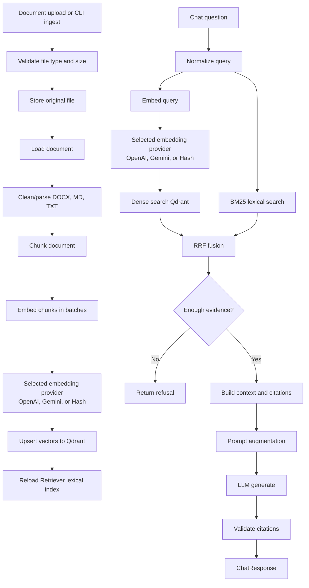

| Giai đoạn | Kiến trúc hiện tại | Source |
|---|---|---|
| Ingestion | Validate `.docx`, `.md`, `.txt`; file size theo `MAX_UPLOAD_MB`; hash để skip nếu READY | Source: `app/ingestion/pipeline.py`; Function/Class: `add_document_path()`, `add_document_bytes()`, `_validate_file()` |
| Cleaning/parsing | DOCX dùng `python-docx` và XML zip; MD/TXT đọc line không rỗng | Source: `app/ingestion/loader.py`; Function/Class: `load_document()` |
| Chunking | Tạo parent/child chunk từ section, heading, token estimate | Source: `app/ingestion/chunker.py`; Function/Class: `chunk_document()` |
| Embedding | Batch theo `embedding_batch_size`, gọi `embed_texts()` | Source: `app/ingestion/pipeline.py`; Function/Class: `_embed_and_index()` |
| Vector DB | Qdrant collection cosine vector; upsert/search/delete/scroll | Source: `app/providers/vector_store/qdrant_store.py`; Function/Class: `QdrantVectorStore` |
| Metadata | Chunk payload gồm document, section, knowledge type, domain, image IDs, language, parent flag | Source: `app/domain/models.py`; Function/Class: `Chunk.payload()` |
| Metadata classification | `_build_chunk()` gọi `classify_knowledge_type()` và `infer_domain()` để gán `knowledge_type` và `domain` | Source: `app/ingestion/chunker.py`; Function/Class: `_build_chunk()`; Source: `app/ingestion/classifier.py`; Function/Class: `classify_knowledge_type()`, `infer_domain()` |
| Retrieval | Dense search Qdrant + BM25 lexical search | Source: `app/rag/retriever.py`; Function/Class: `retrieve()` |
| Top-k | `dense_top_k=15`, `lexical_top_k=15`, `fusion_top_k=20`, `final_context_top_n=4` mặc định | Source: `app/config.py`; Function/Class: `Settings` |
| Threshold | Refuse khi `candidate_count == 0` hoặc best score `< min_retrieval_score`, mặc định `0.01` | Source: `app/rag/response_validator.py`; Function/Class: `should_refuse()` |
| Reranking | Config có `reranker_enabled` và `reranker_model`, nhưng `Retriever` trả `reranker_used=False`; class `Reranker` chỉ sort theo score nếu gọi trực tiếp | Source: `app/rag/retriever.py`; Function/Class: `retrieve()` |
| Context construction | Chọn chunk theo `final_context_top_n`, giới hạn `max_context_tokens` | Source: `app/rag/context_builder.py`; Function/Class: `build_context()` |
| Prompt augmentation | Ghép context và question vào user prompt | Source: `app/rag/prompts.py`; Function/Class: `build_user_prompt()` |
| No-result behavior | Trả refusal cố định, citations rỗng | Source: `app/rag/pipeline.py`; Function/Class: `answer()` |

### 7.4 AI Capability Chưa Có Bằng Chứng

| Capability | Trạng thái |
|---|---|
| Agent runtime | Chưa xác định được từ source code hiện tại. |
| STT | Chưa xác định được từ source code hiện tại. |
| TTS | Chưa xác định được từ source code hiện tại. |
| Tool calling | Chưa xác định được từ source code hiện tại. |
| Structured output contract với provider | Chưa xác định được từ source code hiện tại. |
| Max output token | Chưa xác định được từ source code hiện tại. |
| Retry provider | Chưa xác định được từ source code hiện tại. |

## 8. Các Flow Chính

### 8.1 Flow: Chat/RAG Answer

#### Mục đích

Trả lời câu hỏi người dùng dựa trên tài liệu đã ingest, kèm citation và metadata retrieval.

#### Trigger

`POST /api/v1/chat`.

#### Thành phần tham gia

`routes_chat`, `RAGPipeline`, `QueryNormalizer`, `Retriever`, embedding provider, `QdrantVectorStore`, `LexicalIndex`, `build_context`, `build_citations`, LLM provider, response validator.

#### Input

```json
{
  "question": "string",
  "filters": {
    "document_ids": ["string"],
    "knowledge_types": ["string"],
    "domains": ["string"],
    "language": "string",
    "include_parent_chunks": false
  }
}
```

#### Các bước xử lý

1. FastAPI route `chat()` nhận `ChatRequest`.
2. Route kiểm tra `len(request.question)` so với `settings.max_question_chars`.
3. `ChatRequest.retrieval_filters()` chuyển `filters` thành `RetrievalFilters` nếu có.
4. Route gọi `get_rag_pipeline().answer(question, filters)`.
5. `RAGPipeline.answer()` normalize question bằng `QueryNormalizer`.
6. Pipeline gọi `Retriever.retrieve(normalized, filters)`.
7. Retriever reload lexical index từ Qdrant nếu chưa loaded.
8. Retriever embed query bằng embedding provider.
9. Retriever dense search Qdrant với `dense_top_k`.
10. Retriever lexical search BM25 với `lexical_top_k`.
11. Retriever fuse dense + lexical bằng reciprocal rank fusion với `fusion_top_k`.
12. Pipeline kiểm tra `should_refuse(candidate_count, best_score, min_retrieval_score)`.
13. Nếu refuse, pipeline trả answer refusal, citations rỗng.
14. Nếu đủ evidence, pipeline build context từ top chunks theo `final_context_top_n` và `max_context_tokens`.
15. Pipeline load image lookup theo `document_id`.
16. Pipeline build citations.
17. Pipeline build user prompt từ context + question.
18. Pipeline gọi `llm_provider.generate(SYSTEM_PROMPT, user_prompt)`.
19. Pipeline remove unknown citations và append citation fallback nếu cần.
20. Pipeline trả `ChatResponse` gồm `answer`, `citations`, retrieval meta, timing.

#### Output

```json
{
  "answer": "string",
  "citations": [
    {
      "citation_id": "SOURCE_1",
      "document_name": "string",
      "section": "string",
      "chunk_id": "string",
      "excerpt": "string",
      "images": []
    }
  ],
  "retrieval": {
    "candidate_count": 1,
    "context_count": 1,
    "reranker_used": false
  },
  "timing_ms": {
    "retrieval": 0,
    "rerank": 0,
    "llm": 0,
    "total": 0
  }
}
```

#### Sequence Diagram

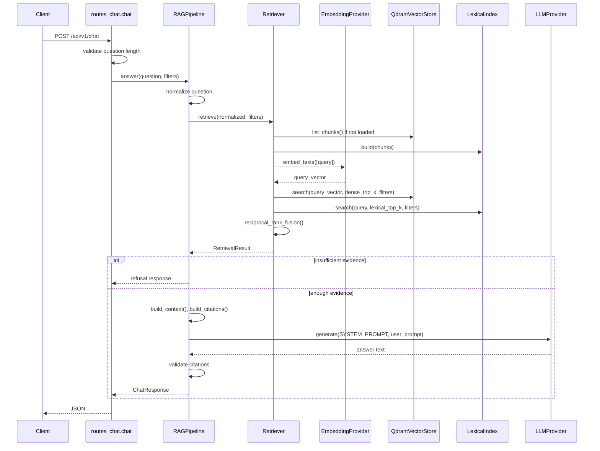

#### Error Cases

| Trường hợp | Nguyên nhân | Xử lý hiện tại | Kết quả |
|---|---|---|---|
| Question quá dài | `len(question) > max_question_chars` | Raise `HTTPException(422)` | Client nhận 422 |
| Không đủ evidence | Không có candidate hoặc best score dưới threshold | Trả refusal response | HTTP 200 với citations rỗng |
| Embedding lỗi | Thiếu API key hoặc provider status `>=400` | Raise `EmbeddingError` | Global handler trả 500 JSON |
| Qdrant/search lỗi | Exception từ vector store không được catch tại route | Exception handler xử lý nếu là `ApplicationError` hoặc `Exception` | 500 JSON |
| LLM lỗi | Provider HTTP error/status `>=400`/thiếu config | Raise `LLMProviderError` | Global handler trả 500 JSON |

#### Retry, timeout và fallback

| Loại | Hiện trạng |
|---|---|
| Retry | Chưa xác định được từ source code hiện tại. |
| Timeout | Embedding `30s`; OpenAI/Gemini LLM `90s`; Ollama theo `llm_timeout_seconds`, mặc định `240s`; UI chat `120s`. |
| Fallback | Refusal khi thiếu evidence; citation cleanup/append; Echo provider chỉ khi cấu hình `LLM_PROVIDER=echo`. |

#### Logging và monitoring

Exception được log bằng `logging.exception()` trong global handler. Timing của RAG response được trả trong `timing_ms`. Không thấy metrics/tracing backend.

#### Source references

Source: `app/api/routes_chat.py`  
Function/Class: `chat()`

Source: `app/rag/pipeline.py`  
Function/Class: `RAGPipeline.answer()`

Source: `app/rag/retriever.py`  
Function/Class: `Retriever.retrieve()`

Source: `app/rag/response_validator.py`  
Function/Class: `should_refuse()`, `remove_unknown_citations()`

### 8.2 Flow: Debug Retrieve

#### Mục đích

Trả về candidate retrieval để debug quá trình tìm kiếm.

#### Trigger

`POST /api/v1/debug/retrieve`.

#### Thành phần tham gia

`routes_chat.debug_retrieve`, `RAGPipeline.normalizer`, `Retriever`.

#### Input

Giống `ChatRequest` của chat endpoint.

#### Các bước xử lý

1. Route đọc `settings.debug_endpoints_enabled`.
2. Nếu disabled, route raise `HTTPException(404)`.
3. Route lấy RAG pipeline.
4. Route normalize question.
5. Route gọi `pipeline.retriever.retrieve()`.
6. Route trả `candidate_count` và `payload()` của từng chunk.

#### Output

```json
{
  "candidate_count": 0,
  "candidates": [
    {
      "score": 0.0,
      "metadata": {}
    }
  ]
}
```

#### Sequence Diagram

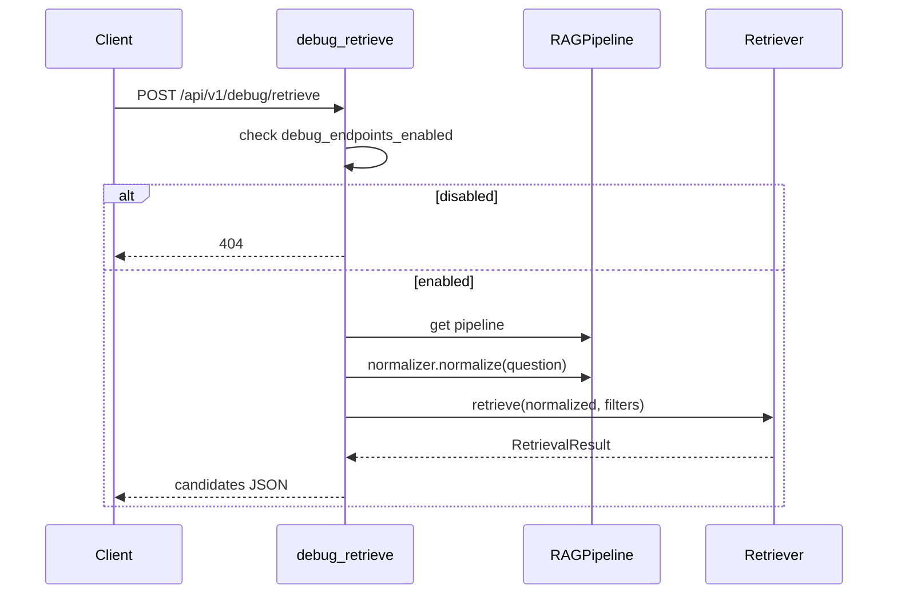

#### Error Cases

| Trường hợp | Nguyên nhân | Xử lý hiện tại | Kết quả |
|---|---|---|---|
| Debug disabled | `debug_endpoints_enabled=False` | Raise `HTTPException(404)` | Client nhận 404 |
| Retrieval/provider lỗi | Lỗi trong retriever/embedding/Qdrant | Global exception handler | 500 JSON |

#### Retry, timeout và fallback

Retry chưa xác định được từ source code hiện tại. Timeout phụ thuộc embedding provider. Không có fallback riêng ngoài global exception handler.

#### Logging và monitoring

Không thấy logging riêng trong route. Lỗi đi qua global exception handler.

#### Source references

Source: `app/api/routes_chat.py`  
Function/Class: `debug_retrieve()`

Source: `app/config.py`  
Function/Class: `Settings`

### 8.3 Flow: Upload Và Ingest Document

#### Mục đích

Thêm tài liệu vào hệ thống, tạo chunks, embedding và index vào Qdrant.

#### Trigger

`POST /api/v1/documents` từ API client hoặc UI Streamlit tab Documents.

#### Thành phần tham gia

Streamlit UI, `routes_documents.add_document`, `_read_upload_limited`, `IngestionPipeline`, `ManifestStore`, document storage, loader/parser/chunker, embedding provider, Qdrant vector store, `Retriever.reload`.

#### Input

Multipart file. Extension được source chấp nhận: `.docx`, `.md`, `.txt`.

#### Các bước xử lý

1. UI nhận file qua `st.file_uploader`.
2. UI POST multipart tới `/api/v1/documents` với timeout `300s`.
3. API route đọc file bằng `_read_upload_limited()` theo chunk 1 MiB.
4. Route gọi `IngestionPipeline.add_document_bytes()`.
5. Pipeline validate extension và size.
6. Pipeline tính SHA-256 hash từ bytes.
7. Pipeline load manifest, nếu hash đã có record READY và không force thì trả response `skipped=True`.
8. Pipeline ghi original bytes vào `data/documents/{document_id}/original/source{suffix}`.
9. Pipeline tạo `DocumentRecord` status `UPLOADED`.
10. Pipeline chuyển status `PARSING` và gọi `load_document()`.
11. Loader parse DOCX bằng `parse_docx()` hoặc đọc MD/TXT line không rỗng.
12. Pipeline chuyển status `CHUNKING`, tạo `DocumentInfo`, gọi `chunk_document()`.
13. Trong quá trình build chunk, `_build_chunk()` gọi `classify_knowledge_type()` và `infer_domain()` để gán metadata `knowledge_type` và `domain`.
14. Pipeline attach image sections, ghi per-document `chunks.json`, `images.json`.
15. Pipeline ghi global snapshot `data/processed/chunks.json`.
16. Pipeline chuyển status `EMBEDDING`, cập nhật counts.
17. Pipeline chuyển status `INDEXING`.
18. Pipeline xóa vector cũ của document trong Qdrant.
19. Pipeline batch embed chunk content theo `embedding_batch_size`.
20. Pipeline upsert vectors/chunks vào Qdrant.
21. Pipeline chuyển status `READY`, `vector_index_status=INDEXED`.
22. Route gọi `get_retriever().reload()` để rebuild BM25 index.
23. Route trả kết quả ingest.

#### Output

```json
{
  "document_id": "string",
  "file_name": "string",
  "original_name": "string",
  "status": "READY",
  "file_hash": "string",
  "parent_chunks": 0,
  "child_chunks": 0,
  "image_count": 0,
  "indexed_chunks": 0,
  "skipped": false,
  "duration_s": 0
}
```

#### Sequence Diagram

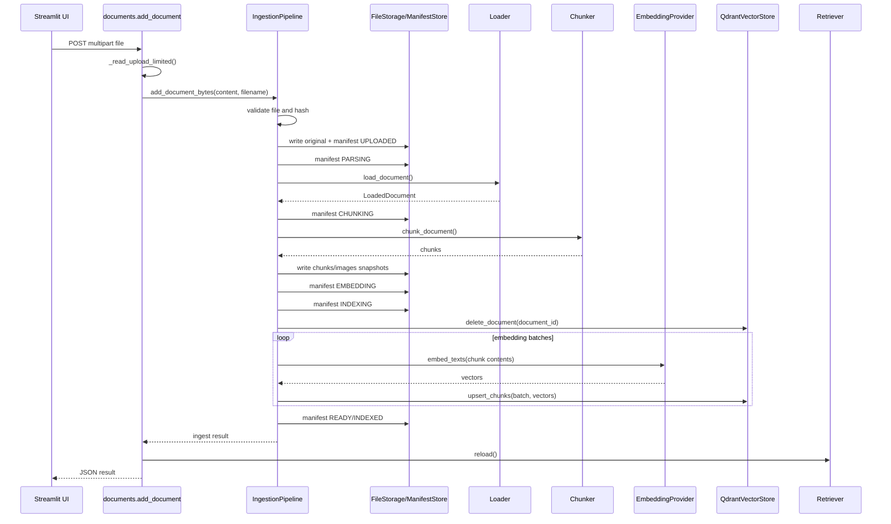

#### Flowchart: Document Status

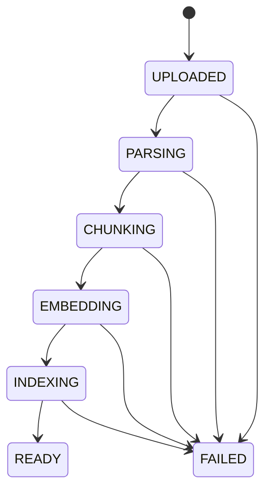

#### Error Cases

| Trường hợp | Nguyên nhân | Xử lý hiện tại | Kết quả |
|---|---|---|---|
| File quá lớn trước khi đọc | `file.size > max_bytes` | Raise `HTTPException(413)` | Client nhận 413 |
| File quá lớn khi đọc stream | Tổng bytes vượt `max_bytes` | Raise `HTTPException(413)` | Client nhận 413 |
| Extension không hỗ trợ | Không phải `.docx`, `.md`, `.txt` | `ValueError`, route chuyển thành 422 | Client nhận 422 |
| Parse DOCX lỗi | `python-docx` hoặc XML parse lỗi | Raise `DocumentParseError`; pipeline ghi FAILED | Global handler trả 500 JSON |
| Embedding/vector lỗi | Provider hoặc Qdrant lỗi | Pipeline ghi FAILED rồi raise | Global handler trả 500 JSON |
| Reload retriever lỗi | `get_retriever().reload()` gọi `vector_store.list_chunks()` lỗi sau khi ingest xong | Exception được raise ngoài pipeline | Global handler trả 500 JSON; manifest có thể đã READY |
| File trùng hash READY | Hash đã có trong manifest và không force | Trả existing response | `skipped=True` |

#### Retry, timeout và fallback

Retry chưa xác định được từ source code hiện tại. UI upload timeout là `300s`. Embedding timeout là `30s` với HTTP providers. Fallback duy nhất của ingestion là skip file trùng hash READY; khi exception xảy ra pipeline ghi FAILED rồi raise.

#### Logging và monitoring

Không thấy logging riêng trong ingestion pipeline. Exception đi qua global handler nếu phát sinh trong API request. Status được ghi vào manifest.

#### Source references

Source: `ui/streamlit_app.py`  
Function/Class: document upload block

Source: `app/api/routes_documents.py`  
Function/Class: `add_document()`, `_read_upload_limited()`

Source: `app/ingestion/pipeline.py`  
Function/Class: `IngestionPipeline`

Source: `app/ingestion/loader.py`  
Function/Class: `load_document()`

Source: `app/ingestion/chunker.py`  
Function/Class: `chunk_document()`

### 8.4 Flow: Reindex Document

#### Mục đích

Rebuild chunks/embedding/vector index cho document đã có trong manifest.

#### Trigger

`POST /api/v1/documents/{document_id}/reindex`.

#### Thành phần tham gia

`routes_documents.reindex_document`, `ManifestStore`, `IngestionPipeline`, Qdrant, embedding provider, `Retriever`.

#### Input

Path parameter `document_id`.

#### Các bước xử lý

1. Route load manifest.
2. Route kiểm tra `document_id` có trong manifest.
3. Nếu không có, route raise `HTTPException(404)`.
4. Route gọi `get_ingestion_pipeline().reindex_document(document_id)`.
5. Pipeline lấy `DocumentRecord`.
6. Pipeline gọi `_ingest_stored_file(..., force=True)` với `record.source_path`.
7. Pipeline thực hiện lại parse/chunk/embed/index như ingestion.
8. Route gọi `get_retriever().reload()`.
9. Route trả ingest result.

#### Output

JSON kết quả giống ingestion.

#### Sequence Diagram

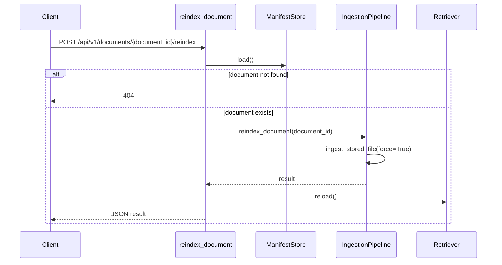

#### Error Cases

| Trường hợp | Nguyên nhân | Xử lý hiện tại | Kết quả |
|---|---|---|---|
| Document không tồn tại | Không có trong manifest | Raise `HTTPException(404)` | Client nhận 404 |
| Source path lỗi | File path trong manifest không đọc được | Exception trong pipeline | Global handler hoặc exception runtime |
| Provider/vector lỗi | Embedding/Qdrant lỗi | Pipeline ghi FAILED rồi raise | 500 JSON nếu qua API handler |
| Reload retriever lỗi | `get_retriever().reload()` gọi `vector_store.list_chunks()` lỗi sau reindex | Exception được raise ngoài pipeline | Global handler trả 500 JSON; reindex có thể đã ghi manifest READY |

#### Retry, timeout và fallback

Retry chưa xác định được từ source code hiện tại. Timeout giống ingestion embedding/vector provider. Không có fallback riêng ngoài FAILED manifest.

#### Logging và monitoring

Không thấy logging riêng trong route/pipeline. Global exception handler log lỗi nếu request đi qua FastAPI handler.

#### Source references

Source: `app/api/routes_documents.py`  
Function/Class: `reindex_document()`

Source: `app/ingestion/pipeline.py`  
Function/Class: `reindex_document()`, `_ingest_stored_file()`

### 8.5 Flow: Delete Document

#### Mục đích

Xóa document khỏi Qdrant, manifest, global chunk snapshot và file storage.

#### Trigger

`DELETE /api/v1/documents/{document_id}`.

#### Thành phần tham gia

`routes_documents.delete_document`, `ManifestStore`, `QdrantVectorStore`, `remove_document_from_global_chunks_snapshot`, `remove_document_storage`, `Retriever`.

#### Input

Path parameter `document_id`.

#### Các bước xử lý

1. Route load manifest.
2. Route kiểm tra `document_id`.
3. Nếu không có, route raise `HTTPException(404)`.
4. Route gọi `get_vector_store().delete_document(document_id)`.
5. Vector store delete points bằng filter `document_id`.
6. Route gọi `manifest_store.remove(document_id)`.
7. Route remove document khỏi `data/processed/chunks.json`.
8. Route xóa thư mục `data/documents/{document_id}` qua `remove_document_storage()`.
9. Storage guard kiểm tra resolved path nằm trong `documents_dir`.
10. Route gọi `get_retriever().reload()`.
11. Route trả status deleted.

#### Output

```json
{
  "status": "deleted",
  "document_id": "string"
}
```

#### Sequence Diagram

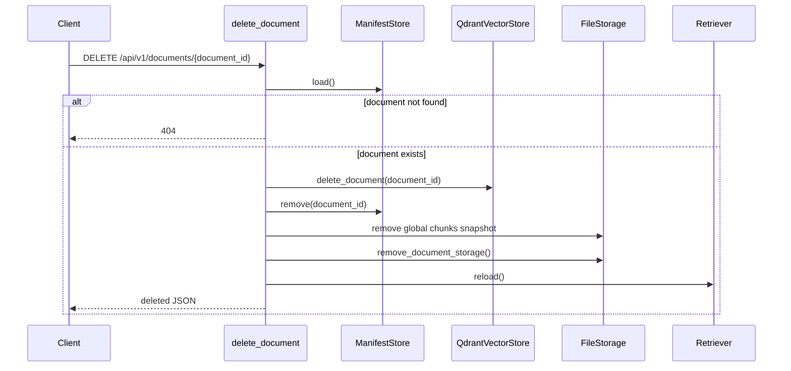

#### Error Cases

| Trường hợp | Nguyên nhân | Xử lý hiện tại | Kết quả |
|---|---|---|---|
| Document không tồn tại | Không có trong manifest | Raise `HTTPException(404)` | Client nhận 404 |
| Path delete không an toàn | Resolved path không nằm trong `documents_dir` | Raise `ValueError` | Global handler nếu qua API |
| Qdrant lỗi | Delete points lỗi | Exception từ vector store | Global handler |
| Reload retriever lỗi | `get_retriever().reload()` gọi `vector_store.list_chunks()` lỗi sau khi xóa | Exception được raise sau các bước delete trước đó | Global handler trả 500 JSON |

#### Retry, timeout và fallback

Retry chưa xác định được từ source code hiện tại. Timeout Qdrant chưa xác định trong source. Nếu Qdrant collection không tồn tại, `delete_document()` return sau `_collection_exists()`.

#### Logging và monitoring

Không thấy logging riêng. Exception được log bởi global handler.

#### Source references

Source: `app/api/routes_documents.py`  
Function/Class: `delete_document()`

Source: `app/providers/vector_store/qdrant_store.py`  
Function/Class: `delete_document()`

Source: `app/documents/storage.py`  
Function/Class: `remove_document_storage()`

### 8.6 Flow: UI Chat

#### Mục đích

Cung cấp trải nghiệm chat qua Streamlit và hiển thị citation/image từ API.

#### Trigger

Người dùng nhập question vào `st.chat_input`.

#### Thành phần tham gia

Streamlit UI, API `/api/v1/documents`, API `/api/v1/chat`, image endpoint.

#### Input

Question text và optional selected documents từ multiselect.

#### Các bước xử lý

1. UI đọc `API_BASE_URL` từ environment, mặc định `http://localhost:8000`.
2. UI gọi `GET /api/v1/documents` timeout `30s` để lấy danh sách document.
3. UI tạo multiselect document filter.
4. Khi user nhập question, UI append message user vào `st.session_state.messages`.
5. UI tạo payload `{"question": question}`.
6. Nếu có selected documents, UI thêm `filters.document_ids` và `include_parent_chunks=false`.
7. UI POST `/api/v1/chat` timeout `120s`.
8. UI render `data["answer"]`.
9. UI render từng citation trong expander.
10. Nếu citation có images, UI gọi URL image từ API và render `st.image`.
11. UI append assistant message vào session state.

#### Output

UI hiển thị answer, citations và images nếu có.

#### Sequence Diagram

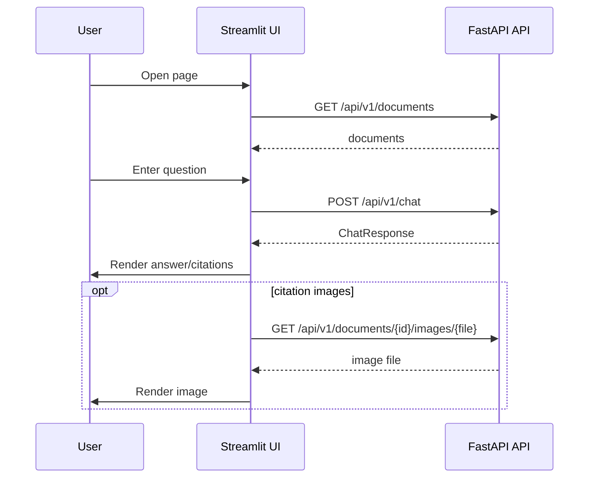

#### Error Cases

| Trường hợp | Nguyên nhân | Xử lý hiện tại | Kết quả |
|---|---|---|---|
| Không load được document list cho filter | `requests.RequestException` | `st.caption()` | UI vẫn hiển thị chat |
| Chat API không phản hồi | `requests.RequestException` | `st.error()` | User thấy lỗi backend tạm thời |
| Upload không ingest được | `requests.RequestException` | `st.error()` | User thấy lỗi ingest |
| Không load được document list ở tab Documents | `requests.RequestException` | `st.warning()` | User thấy warning |

#### Retry, timeout và fallback

Retry chưa xác định được từ source code hiện tại. Timeout UI: document list `30s`, chat `120s`, upload `300s`. Fallback UI là caption/error/warning.

#### Logging và monitoring

Không thấy logging riêng trong UI. Lỗi request được hiển thị trong UI bằng Streamlit message.

#### Source references

Source: `ui/streamlit_app.py`  
Function/Class: module Streamlit app

### 8.7 Flow: CLI Ingestion/Evaluation Operations

#### Mục đích

Hỗ trợ vận hành offline: ingest document, add one document, rebuild index, evaluate retrieval, inspect chunks.

#### Trigger

CLI scripts hoặc Makefile targets.

#### Thành phần tham gia

Scripts, `get_ingestion_pipeline`, `get_manifest_store`, `get_retriever`, file system.

#### Input

CLI args như `--input`, `--force`; dataset `data/evaluation/golden_questions.json`; existing `data/processed/chunks.json`.

#### Các bước xử lý

1. `scripts/ingest_documents.py` nhận một hoặc nhiều `--input`, kiểm tra file tồn tại, gọi `add_document_path()`.
2. `scripts/add_document.py` nhận một `--input`, kiểm tra file tồn tại, gọi `add_document_path()`.
3. `scripts/rebuild_index.py` load manifest, nếu không có documents thì in message; nếu có thì ingest lại từng `record.source_path` với `force=True`.
4. `scripts/evaluate_retrieval.py` đọc golden questions, gọi retriever, tính hit rate/recall/MRR/latency, ghi `retrieval_report.json`.
5. `scripts/inspect_chunks.py` đọc `processed/chunks.json`, ghi `chunks_preview.md`.

#### Output

Console output và file runtime trong `data/evaluation` hoặc `data/processed`.

#### Sequence Diagram

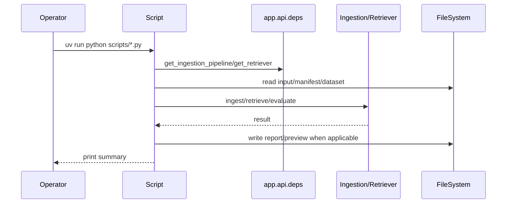

#### Error Cases

| Trường hợp | Nguyên nhân | Xử lý hiện tại | Kết quả |
|---|---|---|---|
| Input file không tồn tại | Path từ CLI không tồn tại | `SystemExit` | Script dừng |
| Không có documents để rebuild | Manifest rỗng | Print message và return | Script kết thúc |
| Golden dataset không tồn tại | Thiếu `data/evaluation/golden_questions.json` | `SystemExit` | Script dừng |
| Không có chunks để inspect | Thiếu `processed/chunks.json` | `SystemExit` | Script dừng |

#### Retry, timeout và fallback

Retry chưa xác định được từ source code hiện tại. Timeout phụ thuộc provider/pipeline được gọi. Rebuild fallback khi manifest rỗng là print `No documents to rebuild.`

#### Logging và monitoring

Scripts dùng `print()` cho output. Không thấy logging/metrics riêng.

#### Source references

Source: `scripts/ingest_documents.py`  
Function/Class: `main()`

Source: `scripts/add_document.py`  
Function/Class: `main()`

Source: `scripts/rebuild_index.py`  
Function/Class: `main()`

Source: `scripts/evaluate_retrieval.py`  
Function/Class: `main()`

Source: `scripts/inspect_chunks.py`  
Function/Class: `main()`

## 9. API

### 9.1 Endpoint Table

| Method | Path | Request | Response | Error cases xác định | Source |
|---|---|---|---|---|---|
| GET | `/health` | None | status, qdrant status, providers | Qdrant unavailable được trả trong body | Source: `app/api/routes_health.py`; Function/Class: `health()` |
| POST | `/api/v1/chat` | `ChatRequest` | `ChatResponse` | 422 question too long; provider errors qua global handler | Source: `app/api/routes_chat.py`; Function/Class: `chat()` |
| POST | `/api/v1/debug/retrieve` | `ChatRequest` | candidate debug JSON | 404 nếu debug disabled | Source: `app/api/routes_chat.py`; Function/Class: `debug_retrieve()` |
| GET | `/api/v1/documents` | None | `DocumentsResponse` | Chưa xác định error riêng | Source: `app/api/routes_documents.py`; Function/Class: `list_documents()` |
| POST | `/api/v1/documents` | multipart file | ingest result JSON | 413 quá lớn; 422 invalid file; provider errors | Source: `app/api/routes_documents.py`; Function/Class: `add_document()` |
| POST | `/api/v1/documents/upload` | multipart file | ingest result JSON | Giống upload chính | Source: `app/api/routes_documents.py`; Function/Class: `upload_document_compat()` |
| POST | `/api/v1/documents/{document_id}/reindex` | path `document_id` | ingest result JSON | 404 document not found | Source: `app/api/routes_documents.py`; Function/Class: `reindex_document()` |
| DELETE | `/api/v1/documents/{document_id}` | path `document_id` | deleted JSON | 404 document not found | Source: `app/api/routes_documents.py`; Function/Class: `delete_document()` |
| GET | `/api/v1/documents/{document_id}/images/{file_name}` | path params | `FileResponse` | 404 invalid path/not found | Source: `app/api/routes_documents.py`; Function/Class: `get_document_image()` |

### 9.2 Schema Chính

```json
{
  "ChatRequest": {
    "question": "string, min_length=1, max_length=2000",
    "filters": "ChatFilters | null"
  },
  "ChatFilters": {
    "document_ids": ["string"],
    "knowledge_types": ["KnowledgeType"],
    "domains": ["string"],
    "language": "string | null",
    "include_parent_chunks": "boolean | null"
  },
  "ChatResponse": {
    "answer": "string",
    "citations": ["CitationResponse"],
    "retrieval": "RetrievalMeta",
    "timing_ms": "object"
  }
}
```

Source: `app/api/schemas.py`  
Function/Class: `ChatRequest`, `ChatFilters`, `ChatResponse`, `DocumentResponse`

## 10. WebSocket

WebSocket event: Chưa xác định được từ source code hiện tại.

Không có route WebSocket được xác định trong `app/api`. Không có `WebSocket` handler được xác nhận trong source audit.

| Capability | Trạng thái | Source |
|---|---|---|
| WebSocket route | Chưa xác định được từ source code hiện tại. | Source: `docs/01-source-audit.md`; Function/Class: N/A |
| Realtime streaming response | Chưa xác định được từ source code hiện tại. | Source: `app/api/routes_chat.py`; Function/Class: `chat()` |

## 11. Database Và Storage

### 11.1 Database Thường

Relational database, ORM, migration: Chưa xác định được từ source code hiện tại.

### 11.2 Vector Database Và File Storage

| Storage | Dữ liệu | Operation | Source |
|---|---|---|---|
| Qdrant collection `company_knowledge` mặc định | Chunk vectors + payload | create collection, upsert, search, delete, scroll | Source: `app/providers/vector_store/qdrant_store.py`; Function/Class: `QdrantVectorStore` |
| `data/documents/{document_id}/original` | Original uploaded file | write/copy/read for reindex | Source: `app/documents/storage.py`; Function/Class: `write_original_bytes()`, `store_original_file()` |
| `data/documents/{document_id}/images` | Extracted DOCX images | write image files, serve image endpoint | Source: `app/ingestion/docx_parser.py`; Function/Class: `_extract_image()` |
| `data/documents/{document_id}/processed/chunks.json` | Per-document chunk payloads | write during ingestion | Source: `app/ingestion/pipeline.py`; Function/Class: `_write_document_outputs()` |
| `data/documents/{document_id}/processed/images.json` | Per-document image metadata | write during ingestion | Source: `app/ingestion/pipeline.py`; Function/Class: `_write_document_outputs()` |
| `data/processed/documents_manifest.json` | Global document manifest | load/save/upsert/remove | Source: `app/documents/manifest.py`; Function/Class: `ManifestStore` |
| `data/processed/chunks.json` | Global chunks snapshot | update/remove/read by inspect script | Source: `app/ingestion/pipeline.py`; Function/Class: `_write_global_chunks_snapshot()` |

### 11.3 ERD Theo Domain Model

Đây là mô hình domain/file payload từ dataclasses, không phải relational database schema.
Suy luận kỹ thuật: quan hệ `DOCUMENT_RECORD` với `IMAGE_ASSET` được rút ra từ storage layout `data/documents/{document_id}/processed/images.json` và hàm `load_image_lookup()`, không phải từ field `document_id` trực tiếp trong `ImageAsset`.

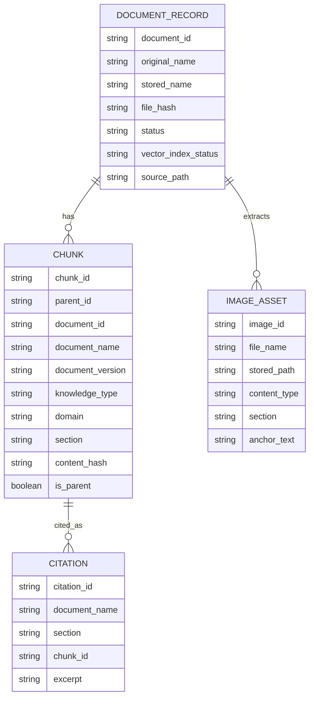

Source: `app/domain/models.py`  
Function/Class: `Chunk`, `Citation`, `ImageAsset`, `RetrievalFilters`

Source: `app/documents/manifest.py`  
Function/Class: `DocumentRecord`

## 12. Redis, Queue Và Pub/Sub

| Thành phần | Trạng thái | Bằng chứng |
|---|---|---|
| Redis server | Chưa xác định được từ source code hiện tại. | Không có dependency/config/usage Redis trong audit |
| Cache | Có `lru_cache` trong process | Source: `app/config.py`; Function/Class: `get_settings()`; Source: `app/api/deps.py`; Function/Class: `get_*()` |
| Queue/job framework | Chưa xác định được từ source code hiện tại. | Không có Celery/RQ/queue service trong compose/source audit |
| Pub/Sub | Chưa xác định được từ source code hiện tại. | Không có Kafka/Rabbit/PubSub usage trong source audit |
| Producer/consumer | Chưa xác định được từ source code hiện tại. | Không thấy worker service độc lập |

## 13. Authentication Và Security

### 13.1 Hiện Trạng Xác Định Từ Source

| Control | Mô tả | Source |
|---|---|---|
| Upload size limit | `_read_upload_limited()` kiểm tra `file.size` và tổng bytes theo `MAX_UPLOAD_MB` | Source: `app/api/routes_documents.py`; Function/Class: `_read_upload_limited()` |
| Upload type validation | Ingestion chỉ chấp nhận `.docx`, `.md`, `.txt` | Source: `app/ingestion/pipeline.py`; Function/Class: `_validate_file()` |
| Image path traversal guard | Reject `file_name` chứa `/` hoặc `\`, resolve path và kiểm tra nằm trong image root | Source: `app/api/routes_documents.py`; Function/Class: `get_document_image()` |
| Delete path guard | `remove_document_storage()` kiểm tra root nằm trong `documents_dir` trước khi `rmtree` | Source: `app/documents/storage.py`; Function/Class: `remove_document_storage()` |
| Prompt guard | System prompt yêu cầu bỏ qua prompt injection trong context | Source: `app/rag/prompts.py`; Function/Class: `SYSTEM_PROMPT` |
| API key config | Provider đọc key từ settings/env, không hardcode secret thật trong source | Source: `app/config.py`; Function/Class: `Settings` |

### 13.2 Chưa Xác Định

Authentication, authorization, session auth, CORS, rate limit, CSRF protection, TLS config: Chưa xác định được từ source code hiện tại.

## 14. Configuration Và Environment Variables

`Settings` dùng `SettingsConfigDict(env_file=".env", env_file_encoding="utf-8", extra="ignore")`.

Source: `app/config.py`  
Function/Class: `Settings`

### 14.1 Environment Variable Table

| Nhóm | Biến | Default/source value | Dùng để làm gì | Source |
|---|---|---|---|---|
| App | `APP_ENV` | `development` | Môi trường app | `app/config.py`, `.env.example` |
| App | `APP_HOST` | `0.0.0.0` | Host app config | `app/config.py`, `.env.example` |
| App | `APP_PORT` | `8000` | Port app config | `app/config.py`, `.env.example` |
| App | `LOG_LEVEL` | `INFO` | Logging level | `app/config.py`, `.env.example` |
| Data | `DATA_DIR` | `data` | Base data dir | `app/config.py`, `.env.example` |
| Data | `UPLOAD_DIR` | `data/uploads` | Upload dir | `app/config.py`, `.env.example` |
| Data | `DOCUMENTS_DIR` | `data/documents` | Document storage | `app/config.py`, `.env.example` |
| Data | `PROCESSED_DIR` | `data/processed` | Processed outputs/manifest | `app/config.py`, `.env.example` |
| Limits | `MAX_UPLOAD_MB` | `50` | Upload file size limit | `app/config.py`, `.env.example` |
| Limits | `MAX_QUESTION_CHARS` | `2000` | Question length limit | `app/config.py`, `.env.example` |
| Qdrant | `QDRANT_URL` | `http://localhost:6333`; compose override `http://qdrant:6333` | Qdrant endpoint | `app/config.py`, `docker-compose.yml` |
| Qdrant | `QDRANT_COLLECTION` | `company_knowledge` | Collection name | `app/config.py`, `.env.example` |
| Embedding | `EMBEDDING_PROVIDER` | `openai` | Select embedding provider | `app/config.py`, `.env.example` |
| Embedding | `OPENAI_API_KEY` | empty | OpenAI auth token; do not document secret value | `app/config.py`, `.env.example` |
| Embedding/LLM | `OPENAI_BASE_URL` | `https://api.openai.com/v1` | OpenAI-compatible base URL | `app/config.py`, `.env.example` |
| Embedding | `OPENAI_EMBEDDING_MODEL` | `text-embedding-3-small` | OpenAI embedding model | `app/config.py`, `.env.example` |
| Embedding/LLM | `GEMINI_API_KEY` | empty | Gemini auth token; do not document secret value | `app/config.py`, `.env.example` |
| Embedding | `GEMINI_EMBEDDING_MODEL` | `text-embedding-004` | Gemini embedding model | `app/config.py`, `.env.example` |
| Embedding | `EMBEDDING_BATCH_SIZE` | `16` | Batch size for chunk embedding | `app/config.py`, `.env.example` |
| LLM | `LLM_PROVIDER` | `ollama` | Select LLM provider | `app/config.py`, `.env.example` |
| LLM | `OLLAMA_BASE_URL` | `http://localhost:11434`; compose override `http://host.docker.internal:11434` | Ollama endpoint | `app/config.py`, `docker-compose.yml` |
| LLM | `OLLAMA_MODEL` | `qwen2.5:3b-instruct` | Ollama model | `app/config.py`, `.env.example` |
| LLM | `LLM_TIMEOUT_SECONDS` | `240` | Ollama client timeout | `app/config.py`, `.env.example` |
| LLM | `OPENAI_MODEL` | empty | OpenAI-compatible chat model | `app/config.py`, `.env.example` |
| LLM | `GEMINI_MODEL` | `gemini-1.5-flash` | Gemini generation model | `app/config.py`, `.env.example` |
| Rerank | `RERANKER_ENABLED` | `false` | Config tồn tại; retriever hiện không dùng reranker provider | `app/config.py`, `.env.example` |
| Rerank | `RERANKER_MODEL` | `BAAI/bge-reranker-v2-m3` | Config model reranker | `app/config.py`, `.env.example` |
| Retrieval | `DENSE_TOP_K` | `15` | Dense retrieval size | `app/config.py`, `.env.example` |
| Retrieval | `LEXICAL_TOP_K` | `15` | BM25 retrieval size | `app/config.py`, `.env.example` |
| Retrieval | `FUSION_TOP_K` | `20` | RRF fused size | `app/config.py`, `.env.example` |
| Retrieval | `RERANK_TOP_K` | `20` | Config tồn tại; không thấy dùng trong `Retriever` hiện tại | `app/config.py`, `.env.example` |
| Retrieval | `FINAL_CONTEXT_TOP_N` | `4` | Number of chunks for context | `app/config.py`, `.env.example` |
| Retrieval | `MIN_RETRIEVAL_SCORE` | `0.01` | Refusal threshold | `app/config.py`, `.env.example` |
| Retrieval | `MAX_CONTEXT_TOKENS` | `3000` | Context token cap | `app/config.py`, `.env.example` |
| Chunking | `CHUNK_TARGET_TOKENS` | `350` | Chunking config | `app/config.py`, `.env.example` |
| Chunking | `CHUNK_MAX_TOKENS` | `550` | Max child chunk tokens | `app/config.py`, `.env.example` |
| Chunking | `CHUNK_OVERLAP_TOKENS` | `40` | Config passed to `ChunkingConfig`; overlap usage cụ thể cần đọc sâu nếu cần | `app/config.py` |
| Chunking | `PARENT_MAX_TOKENS` | `1200` | Parent chunk config | `app/config.py`, `.env.example` |
| Debug | `DEBUG_ENDPOINTS_ENABLED` | `true` | Enable/disable debug retrieve endpoint | `app/config.py`, `.env.example` |
| UI | `API_BASE_URL` | `http://localhost:8000`; compose `http://api:8000` | UI API endpoint | `ui/streamlit_app.py`, `docker-compose.yml` |

### 14.2 Example Environment Block

Không ghi secret thật. Các giá trị key để trống.

```env
APP_ENV=development
APP_HOST=0.0.0.0
APP_PORT=8000
LOG_LEVEL=INFO

QDRANT_URL=http://localhost:6333
QDRANT_COLLECTION=company_knowledge

EMBEDDING_PROVIDER=openai
OPENAI_API_KEY=
OPENAI_BASE_URL=https://api.openai.com/v1
OPENAI_EMBEDDING_MODEL=text-embedding-3-small

LLM_PROVIDER=ollama
OLLAMA_BASE_URL=http://localhost:11434
OLLAMA_MODEL=qwen2.5:3b-instruct
LLM_TIMEOUT_SECONDS=240
```

Runtime `.env` thực tế: Chưa xác định được từ source code hiện tại.

## 15. Docker, Systemd Và Deployment

### 15.1 Dockerfile

API Dockerfile:

```yaml
base_image: ghcr.io/astral-sh/uv:python3.11-bookworm
workdir: /app
expose: 8000
cmd: uv run uvicorn app.main:app --host 0.0.0.0 --port 8000
```

UI Dockerfile:

```yaml
base_image: ghcr.io/astral-sh/uv:python3.11-bookworm
workdir: /app
expose: 8501
cmd: uv run streamlit run ui/streamlit_app.py --server.address 0.0.0.0
```

Source: `docker/Dockerfile.api`  
Function/Class: Dockerfile

Source: `docker/Dockerfile.ui`  
Function/Class: Dockerfile

### 15.2 Docker Compose

| Service | Build/image | Port | Volume | Restart | Healthcheck | Startup dependency |
|---|---|---|---|---|---|---|
| `qdrant` | `qdrant/qdrant:v1.12.1` | `6333:6333` | `qdrant_data:/qdrant/storage` | `unless-stopped` | `wget http://localhost:6333/healthz`, interval `10s`, timeout `5s`, retries `5` | None |
| `api` | build `docker/Dockerfile.api` | `8000:8000` | `./data:/app/data` | `unless-stopped` | Chưa xác định được từ source code hiện tại. | waits for `qdrant` healthy |
| `ui` | build `docker/Dockerfile.ui` | `8501:8501` | Chưa xác định được từ source code hiện tại. | `unless-stopped` | Chưa xác định được từ source code hiện tại. | depends on `api` |

Source: `docker-compose.yml`  
Function/Class: `services`

Network cụ thể: Chưa xác định được từ source code hiện tại.

GPU config: Chưa xác định được từ source code hiện tại.

systemd: Chưa xác định được từ source code hiện tại.

nginx: Chưa xác định được từ source code hiện tại.

CI/CD: Chưa xác định được từ source code hiện tại.

### 15.3 Commands

```bash
make install
make run-api
make run-ui
make test
make lint
make check
make docker-up
make docker-down
make docker-logs
```

Production run command được source xác định trong Dockerfile là Docker CMD của API/UI. Production process manager ngoài Docker: Chưa xác định được từ source code hiện tại.

Source: `Makefile`  
Function/Class: make targets

## 16. Startup Flow

### 16.1 API Startup

1. `main.py:run_api()` chạy Uvicorn với app string `app.main:app`, host `0.0.0.0`, port `8000`, `reload=True`.
2. Trong Docker, CMD chạy `uv run uvicorn app.main:app --host 0.0.0.0 --port 8000`.
3. `app.main` tạo global `app = create_app()`.
4. `create_app()` load settings, configure logging, tạo FastAPI app.
5. App include health/chat/documents routers.
6. App gắn request ID middleware.
7. App gắn exception handlers cho `ApplicationError` và `Exception`.

Source: `main.py`  
Function/Class: `run_api()`

Source: `app/main.py`  
Function/Class: `create_app()`, `request_id_middleware()`

### 16.2 UI Startup

1. `ui.py:run_ui()` set `sys.argv = ["streamlit", "run", "ui/streamlit_app.py"]`.
2. Gọi `streamlit_cli.main()`.
3. Trong Docker, CMD chạy `uv run streamlit run ui/streamlit_app.py --server.address 0.0.0.0`.
4. `ui/streamlit_app.py` đọc `API_BASE_URL`.

Source: `ui.py`  
Function/Class: `run_ui()`

Source: `ui/streamlit_app.py`  
Function/Class: module Streamlit app

### 16.3 Startup Sequence

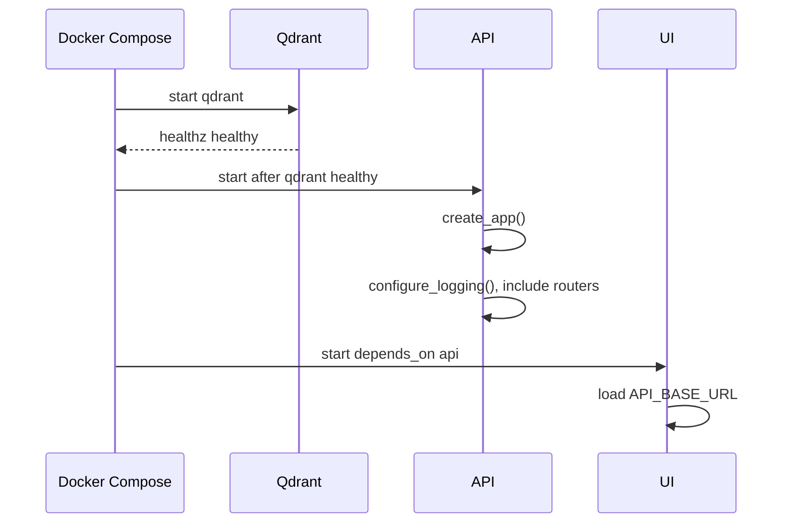

## 17. Logging Và Monitoring

| Capability | Hiện trạng | Source |
|---|---|---|
| Logging setup | `logging.basicConfig` với level từ settings, format có time/level/name/message, stdout handler | Source: `app/utils/logging.py`; Function/Class: `configure_logging()` |
| Request ID | Middleware đọc `x-request-id` hoặc tạo UUID, set response header | Source: `app/main.py`; Function/Class: `request_id_middleware()` |
| Exception logging | `logging.exception("application_error")`, `logging.exception("unhandled_error")` | Source: `app/main.py`; Function/Class: `application_error_handler()`, `unhandled_error_handler()` |
| Health endpoint | Trả `status`, `qdrant`, `llm_provider`, `embedding_provider` | Source: `app/api/routes_health.py`; Function/Class: `health()` |
| Metrics | Chưa xác định được từ source code hiện tại. | N/A |
| Tracing | Chưa xác định được từ source code hiện tại. | N/A |
| Log aggregation | Chưa xác định được từ source code hiện tại. | N/A |

Log command trong Docker Compose:

```bash
make docker-logs
```

Source: `Makefile`  
Function/Class: `docker-logs`

## 18. Error Handling Và Resilience

### 18.1 Exception Hierarchy

| Exception | Code | User message | Source |
|---|---|---|---|
| `ApplicationError` | `APPLICATION_ERROR` | Generic unavailable message | Source: `app/domain/exceptions.py`; Function/Class: `ApplicationError` |
| `ConfigurationError` | `CONFIGURATION_ERROR` | Invalid config | Source: `app/domain/exceptions.py`; Function/Class: `ConfigurationError` |
| `DocumentParseError` | `DOCUMENT_PARSE_ERROR` | Cannot read uploaded doc | Source: `app/domain/exceptions.py`; Function/Class: `DocumentParseError` |
| `EmbeddingError` | `EMBEDDING_ERROR` | Embedding unavailable | Source: `app/domain/exceptions.py`; Function/Class: `EmbeddingError` |
| `VectorStoreError` | `VECTOR_STORE_ERROR` | Knowledge store unavailable | Source: `app/domain/exceptions.py`; Function/Class: `VectorStoreError` |
| `RetrievalError` | `RETRIEVAL_ERROR` | Cannot search documents | Source: `app/domain/exceptions.py`; Function/Class: `RetrievalError` |
| `RerankerError` | `RERANKER_ERROR` | Cannot rerank | Source: `app/domain/exceptions.py`; Function/Class: `RerankerError` |
| `LLMProviderError` | `LLM_PROVIDER_UNAVAILABLE` | LLM unavailable | Source: `app/domain/exceptions.py`; Function/Class: `LLMProviderError` |

### 18.2 Error Handling Matrix

| Layer | Error | Xử lý hiện tại |
|---|---|---|
| API global | `ApplicationError` | Log exception, trả HTTP 500 JSON `{error, request_id}` |
| API global | Any `Exception` | Log exception, trả HTTP 500 JSON `INTERNAL_SERVER_ERROR` |
| Document upload | File quá lớn | HTTP 413 |
| Document upload | Invalid extension | `ValueError` -> HTTP 422 |
| Ingestion | Any exception | Manifest `FAILED`, `vector_index_status=FAILED`, raise lại |
| DOCX parse | Parse exception | Wrap thành `DocumentParseError` |
| Qdrant health | `get_collections()` lỗi | Health response `qdrant=unavailable` |
| RAG | No result/low score | Refusal answer |
| Citation | Unknown citation IDs | Remove unknown citations; append sources if missing |

Retry policy, circuit breaker, rate limit: Chưa xác định được từ source code hiện tại.

Source: `app/main.py`  
Function/Class: `application_error_handler()`, `unhandled_error_handler()`

Source: `app/ingestion/pipeline.py`  
Function/Class: `_ingest_stored_file()`

## 19. Performance Và Scalability

| Tham số/cơ chế | Giá trị hiện tại | Tác động | Source |
|---|---|---|---|
| `MAX_UPLOAD_MB` | `50` | Giới hạn file upload | Source: `app/config.py`; Function/Class: `Settings` |
| `MAX_QUESTION_CHARS` | `2000` | Giới hạn câu hỏi | Source: `app/config.py`; Function/Class: `Settings` |
| `EMBEDDING_BATCH_SIZE` | `16` | Batch embedding chunks | Source: `app/config.py`; Function/Class: `Settings` |
| `DENSE_TOP_K` | `15` | Số kết quả dense Qdrant | Source: `app/config.py`; Function/Class: `Settings` |
| `LEXICAL_TOP_K` | `15` | Số kết quả BM25 | Source: `app/config.py`; Function/Class: `Settings` |
| `FUSION_TOP_K` | `20` | Số kết quả RRF | Source: `app/config.py`; Function/Class: `Settings` |
| `FINAL_CONTEXT_TOP_N` | `4` | Số chunk đưa vào context | Source: `app/config.py`; Function/Class: `Settings` |
| `MAX_CONTEXT_TOKENS` | `3000` | Giới hạn context | Source: `app/config.py`; Function/Class: `Settings` |
| BM25 index | In-memory, reload từ Qdrant chunks | Phụ thuộc process memory và reload | Source: `app/rag/retriever.py`; Function/Class: `reload()` |
| Qdrant scroll | page size tối đa `256`, limit default `10_000` | Load chunks cho lexical index | Source: `app/providers/vector_store/qdrant_store.py`; Function/Class: `list_chunks()` |
| UI timeouts | list docs `30s`, chat `120s`, upload `300s` | Client-side wait limit | Source: `ui/streamlit_app.py`; Function/Class: module Streamlit app |

Horizontal scaling, multi-instance consistency của BM25 in-memory index, autoscaling và load balancing: Chưa xác định được từ source code hiện tại.

## 20. Rủi Ro Kỹ Thuật

| Rủi ro | Bằng chứng source | Tác động tiềm năng | Trạng thái |
|---|---|---|---|
| Chưa xác định auth/authorization | Không thấy auth middleware/dependency trong routes audit | API có thể cần bảo vệ trước khi production | Chưa xác định được từ source code hiện tại. |
| Không thấy retry provider | Provider gọi HTTP và raise lỗi, không thấy retry wrapper | Lỗi tạm thời ở AI/Qdrant làm request fail | Chưa xác định được từ source code hiện tại. |
| BM25 index in-process | `Retriever` có `_loaded` và `LexicalIndex` trong memory | Multi-process/multi-instance cần cơ chế reload nhất quán | Suy luận kỹ thuật từ source |
| File system `data` là state quan trọng | Manifest/chunks/images/original file ghi vào `data` | Mất volume làm mất metadata/file processed | Suy luận kỹ thuật từ source |
| Runtime provider thực tế chưa xác định | Chỉ thấy defaults và `.env.example`, không đọc secret/runtime `.env` | Không chắc provider production đang dùng | Chưa xác định được từ source code hiện tại. |
| CI/CD/nginx/systemd/monitoring chưa xác định | Audit không thấy file tương ứng | Thiếu runbook production hoàn chỉnh | Chưa xác định được từ source code hiện tại. |
| Reranker config chưa nối vào retriever | `Retriever` trả `reranker_used=False` | Tên config có thể gây hiểu nhầm về hành vi retrieval | Kiến trúc hiện tại xác định từ source |

## 21. Đề Xuất Cải Tiến

Các mục dưới đây là đề xuất cải tiến, không phải kiến trúc hiện tại.

| Đề xuất | Căn cứ | Mục tiêu |
|---|---|---|
| Bổ sung tài liệu xác nhận auth/CORS/rate limit hoặc implement nếu cần production | Các mục này chưa xác định được từ source | Làm rõ boundary bảo mật |
| Bổ sung retry/backoff cho AI providers nếu yêu cầu vận hành cần chịu lỗi tạm thời | Provider hiện raise lỗi trực tiếp | Tăng resilience |
| Làm rõ chiến lược multi-instance cho `Retriever`/BM25 index | Lexical index nằm trong process và reload thủ công sau ingestion/delete | Tránh stale index khi scale |
| Bổ sung healthcheck cho API/UI trong compose nếu cần | Compose chỉ thấy healthcheck Qdrant | Dễ vận hành deployment |
| Ghi rõ runtime provider trong tài liệu vận hành không chứa secret | Runtime `.env` thực tế chưa xác định | Giảm nhầm lẫn provider/model |
| Tách rõ config reranker chưa được dùng trong retriever hoặc nối provider reranker thật nếu cần | Có config reranker nhưng `reranker_used=False` | Tránh sai lệch giữa config và behavior |

Source: `docs/01-source-audit.md`  
Function/Class: N/A

Source: `app/rag/retriever.py`  
Function/Class: `Retriever.retrieve()`

## 22. Hướng Dẫn Developer Mới

### 22.1 Cài Đặt Và Chạy Local

Các command được source xác định trong Makefile:

```bash
make install
make run-api
make run-ui
```

`make run-api` chạy:

```bash
uv run api
```

`make run-ui` chạy:

```bash
uv run ui
```

Source: `Makefile`  
Function/Class: `install`, `run-api`, `run-ui`

Source: `pyproject.toml`  
Function/Class: `[project.scripts]`

### 22.2 Test, Lint, Check

```bash
make test
make lint
make harness-check
make check
make format
```

Source: `Makefile`  
Function/Class: `test`, `lint`, `harness-check`, `check`, `format`

### 22.3 Docker

```bash
make docker-up
make docker-down
make docker-logs
```

Source: `Makefile`  
Function/Class: `docker-up`, `docker-down`, `docker-logs`

### 22.4 Scripts Vận Hành

| Command | Mục đích | Source |
|---|---|---|
| `uv run python scripts/ingest_documents.py --input <path>` | Ingest một hoặc nhiều tài liệu | Source: `scripts/ingest_documents.py`; Function/Class: `main()` |
| `uv run python scripts/add_document.py --input <path>` | Add một tài liệu | Source: `scripts/add_document.py`; Function/Class: `main()` |
| `uv run python scripts/rebuild_index.py` | Rebuild index từ manifest | Source: `scripts/rebuild_index.py`; Function/Class: `main()` |
| `uv run python scripts/evaluate_retrieval.py` | Evaluate retrieval bằng golden questions | Source: `scripts/evaluate_retrieval.py`; Function/Class: `main()` |
| `uv run python scripts/inspect_chunks.py` | Ghi preview chunks markdown | Source: `scripts/inspect_chunks.py`; Function/Class: `main()` |

## 23. Troubleshooting

| Triệu chứng | Nguyên nhân có căn cứ source | Cách kiểm tra theo source | Kết quả/xử lý hiện tại |
|---|---|---|---|
| `/health` trả `qdrant=unavailable` | `get_collections()` lỗi | Gọi `GET /health`; kiểm tra Qdrant service/port | Health vẫn HTTP 200 với status body |
| Chat trả 500 provider | Thiếu key/model hoặc HTTP status provider lỗi | Kiểm tra env provider không chứa secret trong doc | Global handler trả JSON 500 |
| Upload trả 413 | File vượt `MAX_UPLOAD_MB` | Kiểm tra size file và env | Route trả HTTP 413 |
| Upload trả 422 | Extension không thuộc `.docx`, `.md`, `.txt` | Kiểm tra file suffix | Route trả HTTP 422 |
| Reindex/delete trả 404 | `document_id` không có trong manifest | Gọi `GET /api/v1/documents` | Route trả HTTP 404 |
| UI báo backend không phản hồi | `requests.RequestException` khi gọi API | Kiểm tra `API_BASE_URL` và API service | UI hiển thị error/warning/caption |
| Evaluate dừng vì thiếu golden dataset | Không có `data/evaluation/golden_questions.json` | Kiểm tra file path | Script `SystemExit` |
| Inspect chunks dừng | Không có `data/processed/chunks.json` | Chạy ingestion trước | Script `SystemExit` |

Source: `app/api/routes_health.py`  
Function/Class: `health()`

Source: `ui/streamlit_app.py`  
Function/Class: module Streamlit app

Source: `scripts/evaluate_retrieval.py`, `scripts/inspect_chunks.py`  
Function/Class: `main()`

## 24. Glossary

| Thuật ngữ | Định nghĩa theo source |
|---|---|
| RAG | Pipeline normalize question, retrieve chunks, build context/citations, gọi LLM và validate response |
| Chunk | Đơn vị nội dung lưu trong Qdrant payload, gồm `chunk_id`, `document_id`, `content`, metadata |
| Parent chunk | Chunk có `is_parent=True`, tạo từ toàn section |
| Child chunk | Chunk con từ `_split_section()` |
| Citation | Metadata nguồn trả cho answer: `citation_id`, `document_name`, `section`, `chunk_id`, `excerpt`, `images` |
| Embedding | Vector từ text qua OpenAI/Gemini/Hash provider |
| Vector store | Interface lưu/search/delete/list chunks; implementation hiện tại là Qdrant |
| Qdrant | Vector database service trong Docker Compose |
| BM25 | Lexical search bằng `rank_bm25.BM25Okapi` |
| RRF | Reciprocal rank fusion hợp nhất dense và lexical results |
| Provider | Adapter cho LLM/embedding/vector store |
| Manifest | JSON metadata documents qua `ManifestStore` |
| Reindex | Ingest lại document từ `record.source_path` với `force=True` |
| Refusal | Câu trả lời từ chối khi retrieval không đủ evidence |

Source: `app/domain/models.py`  
Function/Class: `Chunk`, `Citation`, `RetrievalResult`

Source: `app/rag/hybrid_search.py`  
Function/Class: `reciprocal_rank_fusion()`

Source: `app/documents/manifest.py`  
Function/Class: `ManifestStore`

## 25. Phụ Lục

### 25.1 File Quan Trọng

| File | Lý do quan trọng |
|---|---|
| `pyproject.toml` | Dependency, scripts, test/lint config |
| `.env.example` | Env variables mẫu |
| `docker-compose.yml` | Service topology |
| `docker/Dockerfile.api` | API image/run command |
| `docker/Dockerfile.ui` | UI image/run command |
| `app/main.py` | FastAPI app setup |
| `app/api/routes_chat.py` | Chat/debug API |
| `app/api/routes_documents.py` | Document API |
| `app/ingestion/pipeline.py` | Ingestion flow |
| `app/rag/pipeline.py` | RAG answer flow |
| `app/rag/retriever.py` | Retrieval logic |
| `app/providers/llm/factory.py` | LLM provider factory và Echo provider |
| `app/providers/llm/ollama_provider.py` | Ollama LLM provider |
| `app/providers/llm/openai_provider.py` | OpenAI-compatible LLM provider |
| `app/providers/llm/gemini_provider.py` | Gemini LLM provider |
| `app/providers/embeddings/api_provider.py` | OpenAI/Gemini/Hash embedding providers |
| `app/providers/vector_store/qdrant_store.py` | Qdrant vector store provider |
| `ui/streamlit_app.py` | UI behavior |
| `Makefile` | Developer/ops commands |

### 25.2 Docker Compose Snippet

```yaml
services:
  qdrant:
    image: qdrant/qdrant:v1.12.1
    ports:
      - "6333:6333"

  api:
    build:
      dockerfile: docker/Dockerfile.api
    ports:
      - "8000:8000"
    volumes:
      - ./data:/app/data

  ui:
    build:
      dockerfile: docker/Dockerfile.ui
    ports:
      - "8501:8501"
```

Source: `docker-compose.yml`  
Function/Class: `services`

### 25.3 Thông Tin Chưa Xác Định

- Relational database, ORM, migrations.
- Redis/cache server.
- Queue/job framework.
- Pub/Sub.
- Worker service.
- STT/TTS.
- WebSocket.
- Authentication/authorization.
- CORS/rate limiting.
- CI/CD.
- nginx.
- systemd.
- GPU.
- Production domain/TLS/autoscaling.
- Metrics/tracing/log aggregation.
- Runtime `.env` thực tế và provider/model production.

Tất cả các mục trên: Chưa xác định được từ source code hiện tại.

## 26. Self-Check

| Kiểm tra | Kết quả |
|---|---|
| Tất cả mục trong outline đã được viết | Đã bao phủ mục 1-25 |
| Tất cả flow có source references | Đã có source references trong từng flow |
| Có thông tin không có bằng chứng | Các phần thiếu đã ghi “Chưa xác định được từ source code hiện tại.”; phần suy luận được gắn “Suy luận kỹ thuật” |
| Secret thật bị lộ | Không ghi secret thật; chỉ ghi tên biến env |
| Mermaid hợp lệ ở mức cú pháp cơ bản | Có architecture flowchart, RAG flowchart, startup sequence, flow sequence diagrams, state diagram, ERD |
